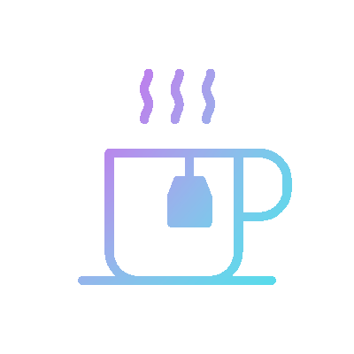

  

 

Hello World , I'm a passionate frontend developer who strives to maintain the developed codes DRY and have a proclivity towards the aesthetically pleasing interface. I'm constantly on the lookout for growth possibilities in the Web space [ mainly Open Source 🫶 ]

 

## About Me 👩‍🦰 
 

- 🔭 I’m currently working in the role of Frontend Developer
- 🌱 I’m currently learning GraphQl, Component Testing
- ⚙️ I use daily: `.ts`, `.js`, `.html`, `.css`, `.ts`, `.yml`
- 👯 I’m looking to collaborate on Open Source projects
- 📫 How to reach me: [https://twitter.com/Swikriti_Kc7]
- 😄 Pronouns: She/Her
- ⚡ Fun fact: Exploring the universe through documentaries, diving into the World of History
- 💛 You can reach me at: -> 

&nbsp;&nbsp;&nbsp;&nbsp;
</a>

  
  
  

 

 

## Tools and Techologies

 

| Based on Category | Tools  |
| :---         |     :---:      |
| `Code Editors` | Visual Studio Code     | 
| `Version Control Systems`    |  , Bitbucket |
| `Css Preprocessors` |  |
| `Frontend Boiler Plates` |  |
| `Frontend CSS Frameworks` |  ,  |
| `UI Component Library` | ,  |
| `Frontend Libraries` |   |
| `Frontend Framework` |  |
| `Scripting Language` |   |
|`Package Managers` |  |
| `Developer tools` |   |
| `Online Coding Environments` |    

 
 
   

  
   
  
  Have A Great Day! 

<!--
**swikritii/swikritii** is a ✨ _special_ ✨ repository because its `README.md` (this file) appears on your GitHub profile.

Here are some ideas to get you started:

-->
